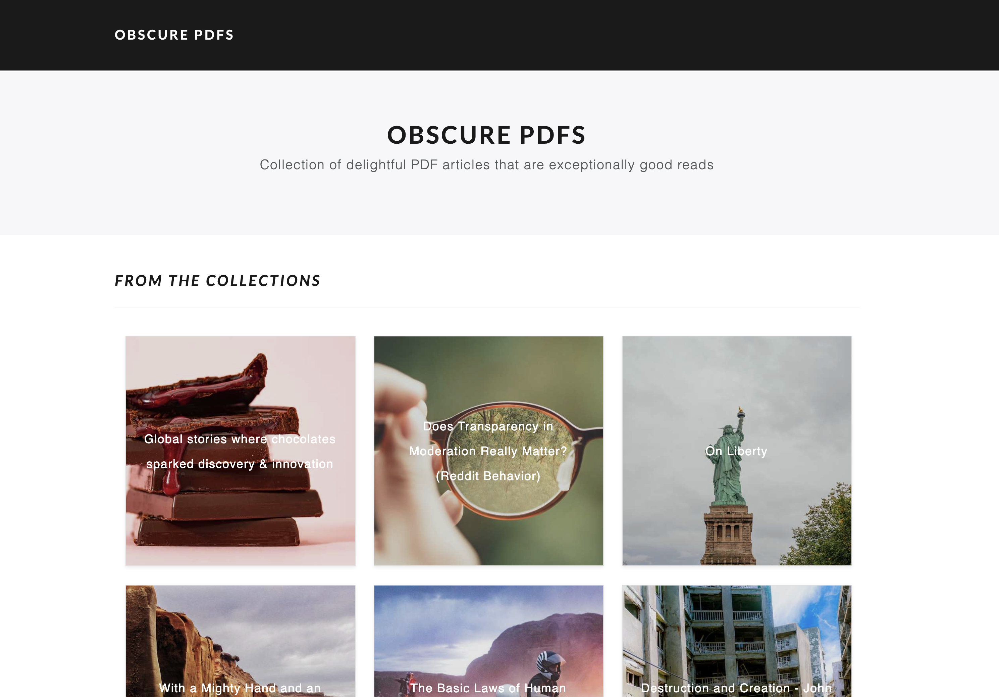

# Obscure PDFs

Collection of delightful PDF articles that are exceptionally good reads

## Contributing

If you've got an improvement, just send in a pull request. If you've got feature ideas, simply [open a new issues](https://github.com/chardmd/obscurepdfs-v2/issues/new)!

## Author

Richard Dimalanta [https://chardmd.com](http://chardmd.com)

